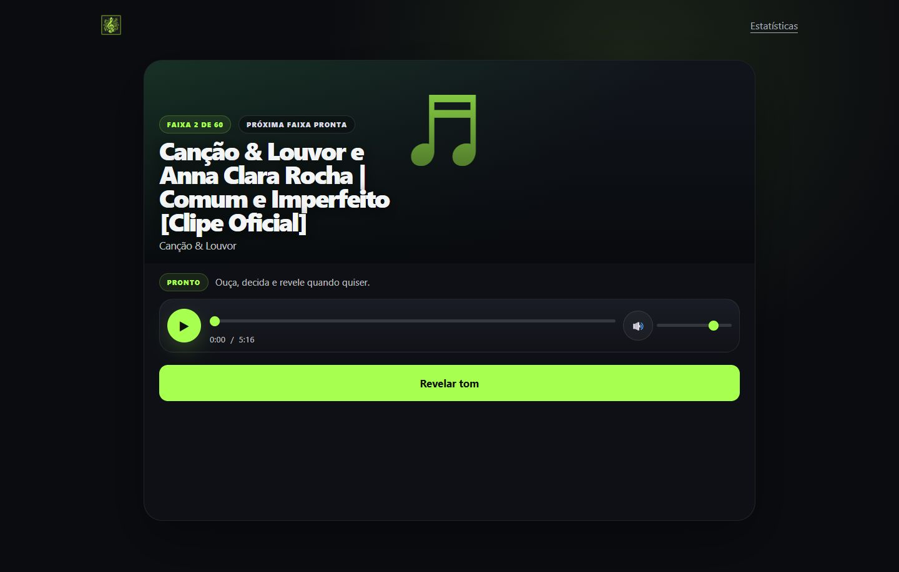
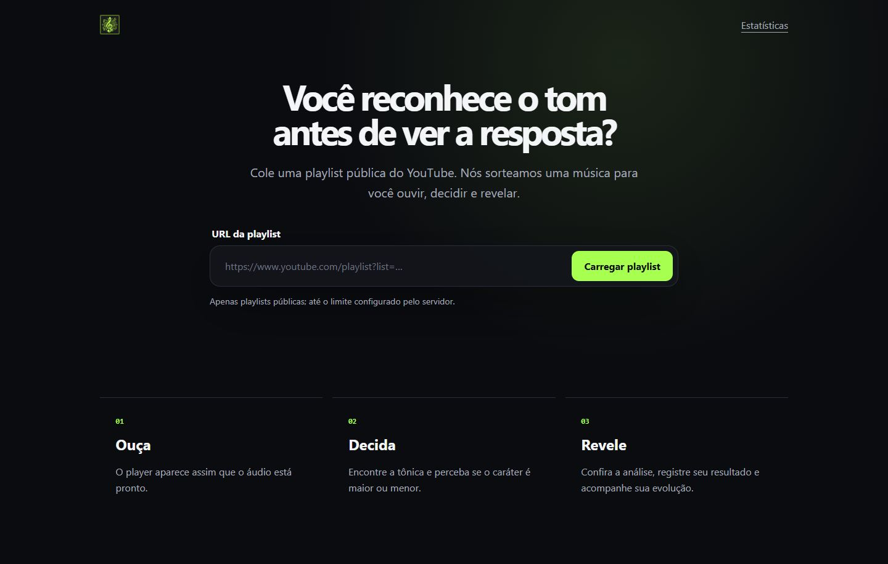
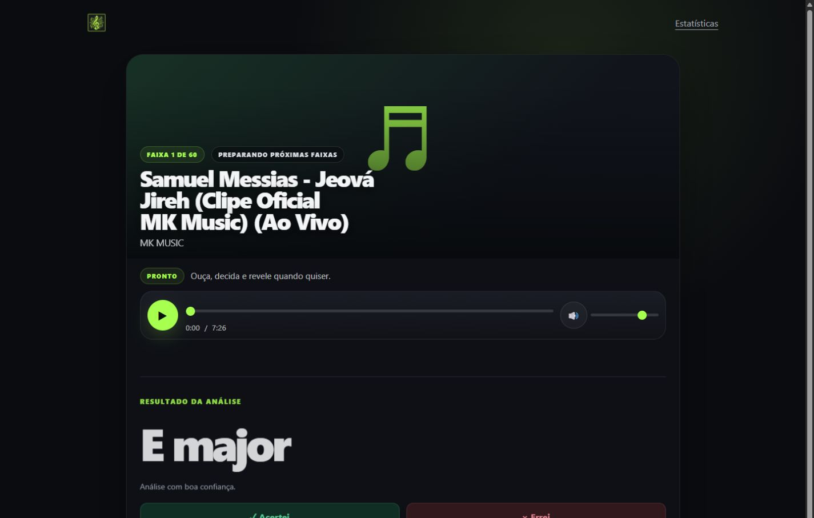
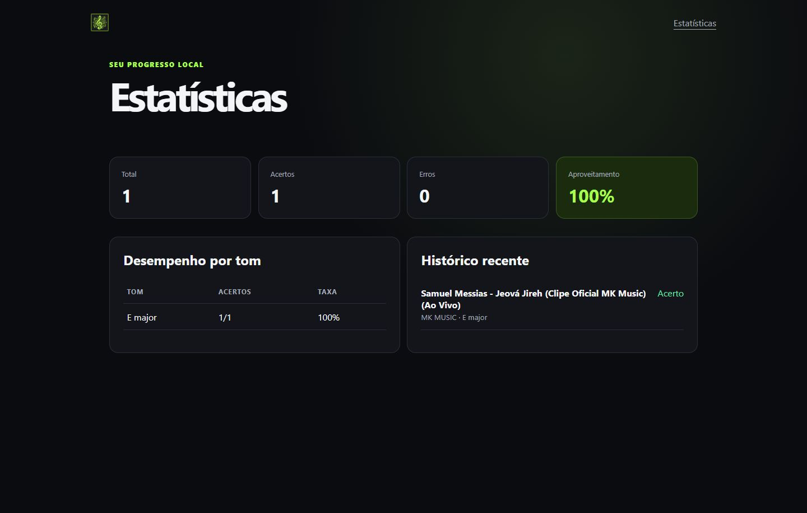
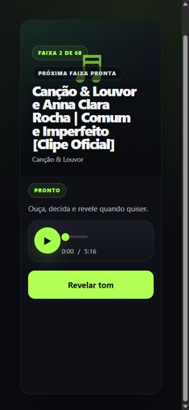

# Key Hunt

Um jogo para treinar seus ouvidos e descobrir o tom das suas músicas favoritas.



## Sobre o jogo

Informe uma playlist pública do YouTube e o Key Hunt escolherá uma música para o desafio. Ouça com atenção, tente descobrir o tom e revele a resposta quando estiver pronto.

O tom permanece escondido durante a tentativa. Depois da revelação, você pode registrar se acertou ou errou e acompanhar seu progresso nas estatísticas. As próximas músicas são preparadas antecipadamente para deixar o jogo mais fluido.

## Como jogar

1. Cole o link de uma playlist do YouTube.
2. Ouça a música sorteada.
3. Tente identificar o tom.
4. Revele a resposta e registre se acertou ou errou.

## Telas

<table>
  <tr>
    <td width="50%"></td>
    <td width="50%"></td>
  </tr>
  <tr>
    <td align="center"><strong>Página inicial</strong></td>
    <td align="center"><strong>Desafio musical</strong></td>
  </tr>
  <tr>
    <td width="50%"></td>
    <td width="50%"></td>
  </tr>
  <tr>
    <td align="center"><strong>Tom revelado</strong></td>
    <td align="center"><strong>Estatísticas</strong></td>
  </tr>
</table>

<p align="center">
  
</p>

## Executar

Você precisa ter Docker e Docker Compose instalados.

```bash
docker compose up --build
```

Depois, abra [http://localhost:8000](http://localhost:8000) no navegador.

## Licença

O código-fonte do Key Hunt é disponibilizado sob a [Apache License 2.0](LICENSE).

Você pode utilizar, reproduzir e modificar este projeto, desde que preserve os avisos de autoria e atribuição. Consulte também o arquivo [NOTICE](NOTICE).

Copyright © 2026 Henrique Neimog.

Músicas, thumbnails e outros conteúdos obtidos do YouTube permanecem sujeitos aos direitos de seus respectivos proprietários.

## Autor

Desenvolvido por **Henrique Neimog**.
